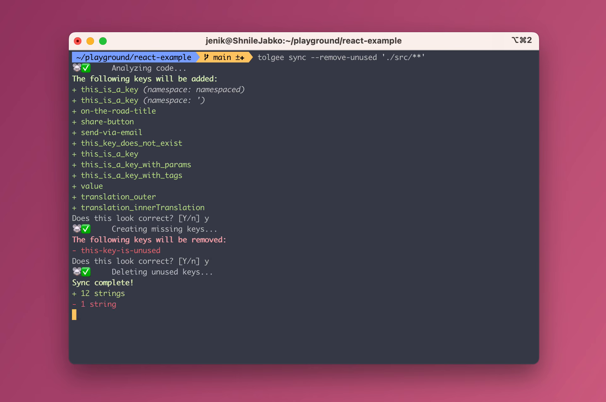

# Tolgee CLI 🐁

A CLI tool to interact with Tolgee directly from your terminal.

The Tolgee CLI lets you pull strings from the Tolgee platform into your projects, push local strings to the Tolgee platform,
extract strings from your code, and much more!



## Installation
The Tolgee CLI is published as a NPM package. You simply need to install it, and you're good to go!

```sh
# npm
npm i --global @tolgee/cli

# Yarn
yarn global add @tolgee/cli

# pnpm
pnpm add --global @tolgee/cli
```

See our [documentation](https://tolgee.io/tolgee-cli/installation) for more information.

### Docker Installation
Alternatively, you can use the Docker image:

```sh
# Pull the latest image
docker pull tolgee/cli:latest

# Run directly
docker run --rm tolgee/cli:latest --help

# Create an alias for easier usage
alias tolgee="docker run --rm -v \$(pwd):/workspace -w /workspace tolgee/cli:latest"
```

The Docker images are available on [Docker Hub](https://hub.docker.com/r/tolgee/cli) and support multiple platforms (linux/amd64, linux/arm64).

## Usage
Once installed, you'll have access to the `tolgee` command. Run `tolgee help` to see all the supported commands, their
options and arguments.

Make sure to give the [docs](https://tolgee.io/tolgee-cli/usage) a look!

## Authentication
Run `tolgee login` with no arguments to sign in through your browser — you approve the CLI on a Tolgee consent
screen and no key is generated, copied or pasted. It needs a browser on the same machine as the CLI, since the
sign-in finishes by redirecting to a local address the CLI is listening on. With `--no-browser` the CLI prints the
URL instead of opening one; the browser you open it in still has to reach this machine.

```sh
tolgee login                # browser sign-in
tolgee login <API key>      # a Personal Access Token or Project API Key, as before
tolgee login --list         # what you are signed in as, per instance
tolgee logout               # ends the session on the server too
tolgee logout --project     # drops only the API key stored for one project
```

If you approve the sign-in for a single project, the CLI takes that project from the approval, so commands need no
`--project-id` and no `projectId` in `.tolgeerc` — the same way a project API key names its own project. Approving
all projects leaves the choice to you, so name the project as before.

On a machine with no browser — CI, a container, an SSH session without port forwarding — use an API key, either
with `--api-key` or through the `TOLGEE_API_KEY` environment variable. Browser sign-in refuses outright in CI,
`--no-browser` included, rather than waiting for an approval that cannot come. If the CI guess is wrong and someone
can approve the sign-in, set `TOLGEE_BROWSER_LOGIN_IN_CI=1`.

Browser sign-in requires a Tolgee instance running the OAuth authorization server; against one that does not, the
CLI says so and points you at API keys.

## Contributing
Contributions are welcome! Check out [HACKING.md](HACKING.md) for some information about the project internals and
information about the workflow.

----
🧀
