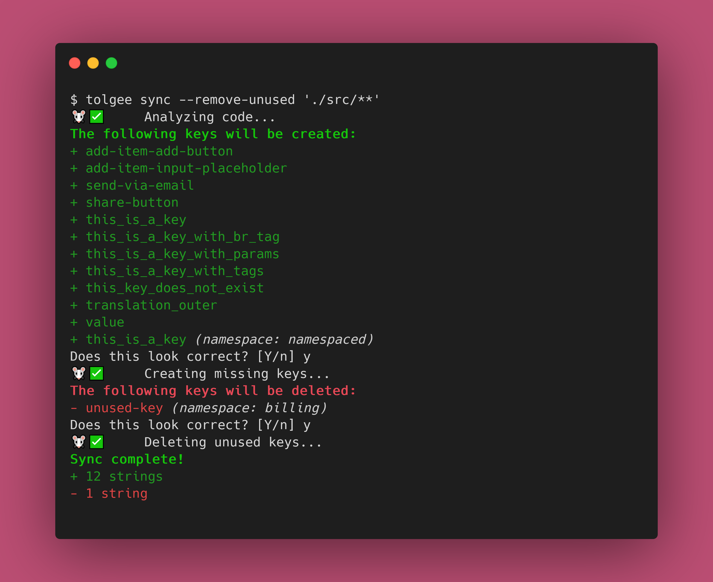

# Tolgee CLI 🐁

A CLI tool to interact with Tolgee directly from your terminal.

The Tolgee CLI lets you pull strings from the Tolgee platform into your projects, push local strings to the Tolgee platform,
extract strings from your code, and much more!



## Installation
The Tolgee CLI is published as a NPM package. You simply need to install it, and you're good to go!

```sh
# npm
npm i --global @tolgee/cli

# Yarn
yarn global add @tolgee/cli

# pnpm
pnpm add --global @tolgee/cli
```

See our [documentation](https://tolgee.io/tolgee-cli/installation) for more information.

## Usage
Once installed, you'll have access to the `tolgee` command. Run `tolgee help` to see all the supported commands, their
options and arguments.

Make sure to give the [docs](https://tolgee.io/tolgee-cli/usage) a look!

## Contributing
Contributions are welcome! Check out [HACKING.md](HACKING.md) for some information about the project internals and
information about the workflow.

----
🧀
